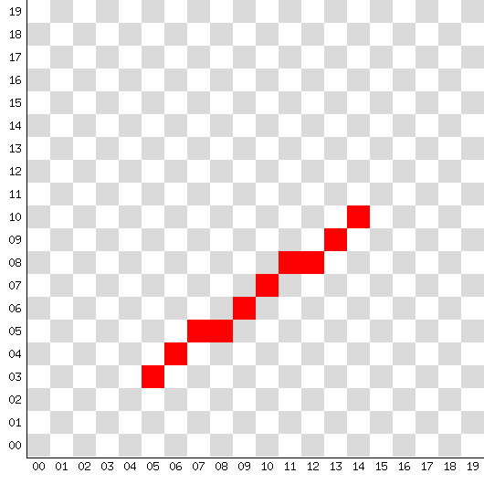
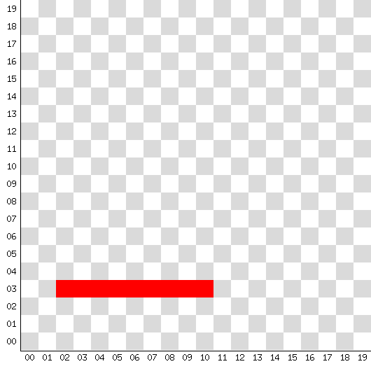
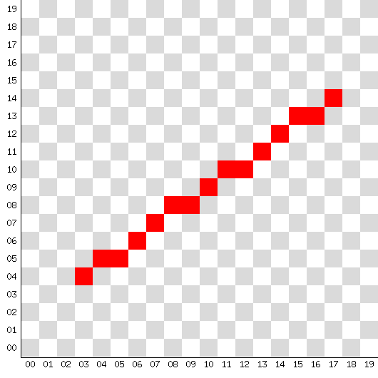

# brlines
simple bresenham line drawing algorithm demonstration implemented with golang,
this was my last week lesson in computer graphics class with Dr. Behzad Zamani

### how to compile
in order to compile and run this project you need to install [go compiler](https://go.dev/dl),
after that run `go build` in project directory to compile brline binary  
or you may download pre-compiled binary for windows and linux from [Releases](https://github.com/Sina-Ghaderi/brlines/releases)

```
# git clone https://git.snix.ir/brlines
# cd brlines && go build 
# ./brlines
```

### how to use
use `./brlines --help` to print help banner, you need to provide 2 points as start and end of the line  
each point has x and y coordinate, so for starting point you should use -xa and -ya flags and for ending point -xb and -yb

```
# ./brlines --help
usage of bresenham line simulator:
./brlines options...

options:
  --pt  <file>      named png file to save bresenham output
                    default path for this file is br_resualt.png

  --xa  <uint>      x coordinate of starting point
  --xb  <uint>      x coordinate of ending point

  --ya  <uint>      y coordinate of starting point
  --yb  <uint>      y coordinate of ending point

example:
   ./brlines --pt mytest.png --xa 8 --ya 3 --xb 2 --yb 10


Copyright (c) 2022 snix.ir, All rights reserved.
Developed BY <Sina Ghaderi> sina@snix.ir
This work is licensed under the terms of GNU General Public license.
Github: github.com/sina-ghaderi and Source: git.snix.ir
```

### testing results
these images has been produced by brlines, output is a png file in 530*530 pixel  
[br_resualt_a](br_resualt_a.png) |  [br_resualt_b](br_resualt_b.png)| [br_resualt_c](br_resualt_c.png)|[br_resualt_d](br_resualt_d.png)
:-------------------------:|:------------------------:|:------------------------:|:-------------------------:
  |         |     |  


